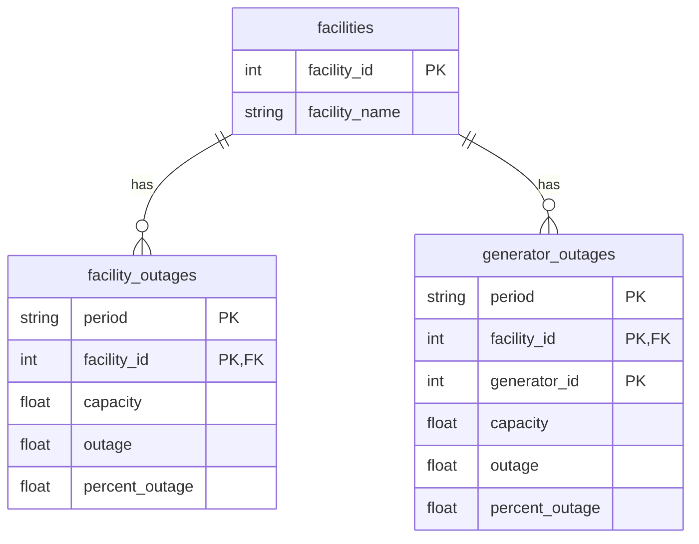

# Nuclear Outages Pipeline

Data pipeline that extracts, models, and visualizes U.S. Nuclear Outages data from the [EIA Open Data API](https://www.eia.gov/opendata/).

---

## Overview

This project is divided into 4 parts:

1. **Connector** — extracts raw data from the EIA API and saves it as Parquet files
2. **Data Model** — cleans, normalizes, and aggregates the raw data
3. **API** — serves the processed data via a REST API built with FastAPI
4. **Frontend** — data preview interface built with React + Vite

---

## Project Structure

```
nuclear-outages-pipeline/
├── api/
│   ├── routes/
│   │   ├── data.py         # GET /data endpoint
│   │   └── refresh.py      # GET /refresh endpoint
│   ├── config.py           # File paths and environment config
│   ├── main.py             # FastAPI app entry point
│   └── schemas.py          # Pydantic response schemas
├── connector/
│   ├── config.py           # EIA API config, date range, datasets
│   ├── fetcher.py          # API requests with pagination and retry
│   ├── main.py             # Connector entry point
│   ├── storage.py          # Saves raw data to Parquet
│   └── validator.py        # Validates required fields
├── data/
│   ├── raw/                # Raw Parquet files from connector
│   ├── processed/          # Cleaned and aggregated Parquet files
│   └── metadata.json       # Tracks global run metadata
├── data_model/
│   ├── aggregator.py       # KPI calculations
│   ├── er_diagram.md       # ER diagram (Mermaid)
│   ├── er_diagram.png      # ER diagram (image)
│   ├── loader.py           # Loads raw Parquet files
│   ├── main.py             # Data model entry point
│   ├── storage.py          # Saves processed Parquet files
│   └── transformer.py      # Cleans and normalizes raw data
├── frontend/               # React + Vite data preview interface
├── tests/
│   ├── conftest.py         # Shared fixtures
│   ├── test_aggregator.py  # Unit tests for KPI calculations
│   └── test_api.py         # Integration tests for API endpoints
├── Dockerfile              # API container
├── docker-compose.yml      # Orchestrates API + Frontend containers
├── .env                    # Environment variables (see setup)
├── requirements.txt        # Python dependencies
└── README.md
```

---

## Data Model



### Tables

**facilities** — one row per nuclear plant (62 total)
- `facility_id` (PK) — unique plant identifier
- `facility_name` — plant name

**facility_outages** — one row per plant per day
- `(period, facility_id)` (PK) — composite primary key
- `capacity` — maximum generation capacity in MW
- `outage` — MW currently offline
- `percent_outage` — percentage of capacity offline

**generator_outages** — one row per generator per day
- `(period, facility_id, generator_id)` (PK) — composite primary key
- Same metrics as facility_outages but at generator level

---

## Business KPIs

Three aggregated datasets computed from facility_outages:

| Dataset | Type param | Business Question |
|---|---|---|
| Plant Performance | `summary` | Which plants are most problematic historically? |
| Monthly Patterns | `seasonality` | Which months concentrate the most outages? |
| System Overview | `us_total` | How much nuclear capacity is offline per day? |

> **Note:** The EIA publishes the US total aggregate directly via their `us-nuclear-outages` endpoint. It is computed here from facility-level data to demonstrate that the pipeline can derive system-wide KPIs from raw data — relevant for scenarios where the source does not provide pre-aggregated metrics.

---

## Requirements

- Python 3.12+
- Node.js 24+
- Docker Desktop (optional, for containerized setup)
- An EIA API key — get one free at [https://www.eia.gov/opendata/](https://www.eia.gov/opendata/)

---

## Setup

### 1. Clone the repository

```bash
git clone https://github.com/Guty90/nuclear-outages-pipeline.git
cd nuclear-outages-pipeline
```

### 2. Configure environment variables

Create a `.env` file in the root of the project:

```env
# EIA API key — get yours at https://www.eia.gov/opendata/
EIA_API_KEY=your_eia_api_key_here

# API key for the FastAPI backend
APP_API_KEY=your_secret_key_here
```

Create a `.env` file inside the `frontend/` folder:

```env
VITE_API_URL=http://localhost:8000
VITE_APP_API_KEY=your_secret_key_here
```

---

## Option A — Running with Docker (recommended)

Make sure Docker Desktop is running, then from the root of the project:

```bash
docker-compose up --build
```

- API: `http://localhost:8000`
- Frontend: `http://localhost:5173`
- Interactive API docs: `http://localhost:8000/docs`

To stop all containers:

```bash
docker-compose down
```

> **Note:** The `data/` folder is mounted as a volume, so Parquet files persist between container restarts.
>
> If no data exists yet, trigger a full refresh after the containers are up.
>
> **Option 1 — Using the frontend (recommended)**  
> Open the frontend and click the **Refresh Data** button to fetch and visualize the data.
>
> **Option 2 — Using the API**
> ```bash
> curl "http://localhost:8000/refresh" -H "X-API-Key: your_secret_key_here"
> ```

---

## Option B — Running Manually

### 1. Create and activate a virtual environment

```bash
python -m venv venv

# macOS / Linux
source venv/bin/activate

# Windows
venv\Scripts\activate
```

### 2. Install Python dependencies

```bash
pip install -r requirements.txt
```

### 3. Configure the date range (optional)

The connector fetches data from `START_YEAR` to `END_YEAR`. You can change this in `connector/config.py`:

```python
START_YEAR = 2015
END_YEAR   = 2026
```

> **Note:** Fetching the full range (2015–2026) takes approximately 5–10 minutes on the first run due to EIA API pagination.

### 4. Run the connector

Fetches raw data from the EIA API and saves it to `data/raw/`.

```bash
python connector/main.py
```

Output files:
- `data/raw/facility_outages.parquet`
- `data/raw/generator_outages.parquet`

> On subsequent runs, new records are merged with the existing Parquet files and deduplicated by primary key, so re-running the connector is safe and will never inflate the dataset with duplicate rows.

### 5. Run the data model

Cleans, normalizes, and aggregates the raw data. Saves results to `data/processed/`.

```bash
python data_model/main.py
```

Output files:
- `data/processed/facilities.parquet`
- `data/processed/facility_outages_clean.parquet`
- `data/processed/generator_outages_clean.parquet`
- `data/processed/facility_summary.parquet`
- `data/processed/seasonality.parquet`
- `data/processed/us_total.parquet`

> **Tip:** Steps 4 and 5 can also be triggered via the `/refresh` API endpoint once the backend is running.

### 6. Run the API

```bash
cd api
uvicorn main:app --reload
```

The API will be available at `http://localhost:8000`.

Interactive docs: `http://localhost:8000/docs`

### 7. Run the Frontend

```bash
cd frontend
npm install
npm run dev
```

The frontend will be available at `http://localhost:5173`.

---

## Running the Tests

```bash
pip install pytest httpx
pytest tests/ -v
```

### Test coverage

- **`test_aggregator.py`** — unit tests for all three KPI calculations (capacity factor, seasonality, US total)
- **`test_api.py`** — integration tests for auth, pagination, filters and response structure

---

## API Reference

### Endpoints

#### `GET /data`

Returns filtered data from the processed Parquet files.

| Parameter | Type | Default | Description |
|---|---|---|---|
| `type` | string | `facility` | Dataset: `facility`, `generator`, `facilities`, `summary`, `seasonality`, `us_total` |
| `page` | int | `1` | Page number |
| `limit` | int | `100` | Records per page |
| `facility_id` | int | — | Filter by facility (only for `facility` and `generator`) |
| `start_date` | string | — | Filter from date `YYYY-MM-DD` (only for `facility` and `generator`) |
| `end_date` | string | — | Filter to date `YYYY-MM-DD` (only for `facility` and `generator`) |

Example:
```bash
curl "http://localhost:8000/data?type=facility&facility_id=46&start_date=2026-01-01" \
  -H "X-API-Key: your_secret_key_here"
```

#### `GET /refresh`

Triggers a full data refresh — runs the connector then the data model.

```bash
curl "http://localhost:8000/refresh" \
  -H "X-API-Key: your_secret_key_here"
```

### Authentication

All endpoints require an `X-API-Key` header matching the `APP_API_KEY` environment variable. Requests without a valid key return `401`.

---

## Incremental Extraction

The connector always fetches from `last_extraction_date` and deduplicates on merge.

`data/metadata.json` tracks global run metadata:

```json
{
  "last_extraction_date": "2026-03-29",
  "last_run_at": "2026-03-29T23:58:59.203223",
  "facility_records": 0,
  "generator_records": 0,
  "refresh_count": 8
}
```

On each run, incoming records are merged with the existing Parquet files and deduplicated by primary key (`keep="last"`), so calling `/refresh` repeatedly is safe — it will never inflate the dataset with duplicate rows.

---

## Assumptions & Design Decisions

**Parquet over Delta Tables** — Delta Tables would be more efficient on merges since they append change logs instead of rewriting the full file. However, Parquet was chosen for its simplicity and because the dataset (up to ~1M records historically) is not large enough to justify the operational overhead of Delta's vacuum and optimize operations. For datasets in the tens of millions, Delta Tables would be the better choice.

**FastAPI over Flask/Django** — FastAPI is the industry standard for modern Python APIs. The `/docs` interface it provides out of the box makes it easy to explore and test endpoints without any extra tooling.

**Parquet deduplication with `keep="last"`** — The EIA occasionally corrects historical data retroactively. Deduplicating by primary key on merge ensures those corrections are always reflected in the dataset, which a simple date-based append strategy would miss.

**Year-by-year pagination** — The EIA API has an undocumented limit of ~400k records per request, even with pagination. The generator dataset exceeds 600k records historically, which caused downloads to silently cut off when fetching the full range at once. Splitting by year keeps each request well under that limit with ~60k records per request.

**Only `facility` and `generator` datasets extracted** — These two endpoints contain all the granularity needed to answer business questions at both the plant and unit level. The EIA also publishes a pre-aggregated US total endpoint, but the `us_total` KPI is computed here from facility-level data to demonstrate that system-wide metrics can be derived from raw data — useful when a data source does not provide pre-aggregated values.

**`metadata.json` for run tracking** — The simplest way to support incremental extraction without reading the existing Parquet files to determine what's already been stored. On the first run, all years are fetched individually; on subsequent runs, only data from `last_extraction_date` to today is fetched, then merged and deduplicated.

**React + Vite + Tailwind CSS** — Chosen for familiarity and speed of development. Vite is well-suited for projects of this scale, and Tailwind avoids the overhead of managing custom CSS.

**Docker with volume mount for `data/`** — The `data/` directory is mounted as a volume in `docker-compose.yml` so that Parquet files generated by the connector persist across container restarts. Without this, all extracted data would be lost every time the container is rebuilt.

**Plant Performance — Capacity Factor (Renewable Electricity %)** — The Plant Performance analysis was included based on S&P Global Market Intelligence's KPI Guide for the power generation industry (https://www.spglobal.com/market-intelligence/en/news-insights/resources/kpi-guides/power-generation). According to this source, the Capacity Factor —which measures the percentage of renewable electricity actually generated (solar, wind, hydro, and geothermal) relative to the maximum possible capacity— is one of the most critical KPIs in the sector. This indicator enables companies to assess how efficiently a plant operates against its installed potential, making it essential for operational, investment, and maintenance decision-making.

**Monthly Patterns — Identifying Low-Demand Months** — The Monthly Patterns analysis was incorporated based on information published by the U.S. Energy Information Administration (EIA) (https://www.eia.gov/todayinenergy/detail.php?id=23112). According to this source, understanding which months of the year experience lower electricity demand represents a significant strategic advantage for companies in the sector. This knowledge allows them to schedule preventive or corrective maintenance on their generators during low-consumption periods, thereby minimizing the impact on end users and maximizing infrastructure availability during peak demand seasons.

**Known limitation / future improvement** — Currently, every refresh re-reads the existing Parquet file and rewrites it even if there are no new records. A future improvement would be to compare the incoming records against the existing dataset before writing, and skip the write if nothing has changed.

---

## Result Examples

Each dataset returned by `GET /data` has a consistent envelope: `total`, `page`, `limit`, and `data`.

### Facility Outages (`type=facility`)

One row per plant per day — capacity, outage in MW, and percentage offline.

```json
{
  "total": 235727,
  "page": 1,
  "limit": 2,
  "data": [
    { "period": "2026-03-27", "facility_id": 46, "capacity": 3755.8, "outage": 1070.15, "percent_outage": 28.49 },
    { "period": "2026-03-27", "facility_id": 204, "capacity": 1107.1, "outage": 0, "percent_outage": 0 }
  ]
}
```


---

### Generator Outages (`type=generator`)

Same metrics as facility outages but broken down by individual generator unit.

```json
{
  "total": 393279,
  "page": 1,
  "limit": 2,
  "data": [
    { "period": "2026-03-27", "facility_id": 46, "generator_id": 1, "capacity": 1254.8, "outage": 0, "percent_outage": 0 },
    { "period": "2026-03-27", "facility_id": 46, "generator_id": 2, "capacity": 1242, "outage": 0, "percent_outage": 0 }
  ]
}
```


---

### Facilities (`type=facilities`)

Reference table — one row per plant with its ID and name (62 total).


---

### Plant Performance (`type=summary`)

Historical KPI per plant: average capacity factor, average and max outage %, total MW lost, days with outage, and active status.

```json
{
  "total": 62,
  "page": 1,
  "limit": 2,
  "data": [
    { "facility_id": 6072, "avg_percent_outage": 23.95, "max_percent_outage": 100, "total_mw_lost": 1389463.4, "days_with_outage": 1725, "avg_capacity_factor": 76.05, "total_records": 4104, "last_reported": "2026-03-27", "is_active": true },
    { "facility_id": 6153, "avg_percent_outage": 18.02, "max_percent_outage": 100, "total_mw_lost": 913610.6, "days_with_outage": 850, "avg_capacity_factor": 81.98, "total_records": 4104, "last_reported": "2026-03-27", "is_active": true }
  ]
}
```


---

### Monthly Patterns (`type=seasonality`)

Aggregated by calendar month across all years — identifies which months concentrate the most outages historically.

```json
{
  "total": 12,
  "page": 1,
  "limit": 2,
  "data": [
    { "month": 1, "avg_percent_outage": 3.26, "avg_mw_offline": 49.3, "total_mw_lost": 1053383.6, "record_count": 21387 },
    { "month": 2, "avg_percent_outage": 6.51, "avg_mw_offline": 109.9, "total_mw_lost": 2143125.5, "record_count": 19506 }
  ]
}
```


---

### System Overview (`type=us_total`)

Daily US-wide totals: combined capacity, total MW offline, percentage offline, and number of active facilities.

```json
{
  "total": 4104,
  "page": 1,
  "limit": 2,
  "data": [
    { "period": "2026-03-27", "total_capacity": 100013.2, "total_mw_offline": 19357.7, "active_facilities": 55, "percent_offline": 19.36 },
    { "period": "2026-03-26", "total_capacity": 100013.2, "total_mw_offline": 19738.5, "active_facilities": 55, "percent_offline": 19.74 }
  ]
}
```


---

## Tech Stack

| Layer | Technology |
|---|---|
| Data extraction | Python, Requests, Pandas |
| Data storage | Apache Parquet |
| API | FastAPI, Pydantic, Uvicorn |
| Frontend | React, Vite, Tailwind CSS, Lucide React, React Icons |
| Containerization | Docker, Docker Compose |
| Tests | Pytest, FastAPI TestClient, httpx |

---

## Data Source

U.S. Energy Information Administration (EIA) — Nuclear Outages  
[https://www.eia.gov/opendata/](https://www.eia.gov/opendata/)