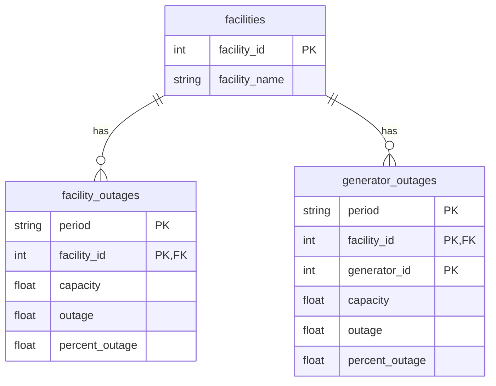

# Nuclear Outages - ER Diagram

## Tables

### facilities
Primary key: `facility_id`
One row per nuclear plant (66 total).

### facility_outages
Primary key: `(period, facility_id)`
One row per plant per day. Foreign key to facilities.

### generator_outages
Primary key: `(period, facility_id, generator_id)`
One row per generator per day. Foreign key to facilities.

## Relationships
- One facility → many facility_outages (one per day)
- One facility → many generator_outages (one per generator per day)